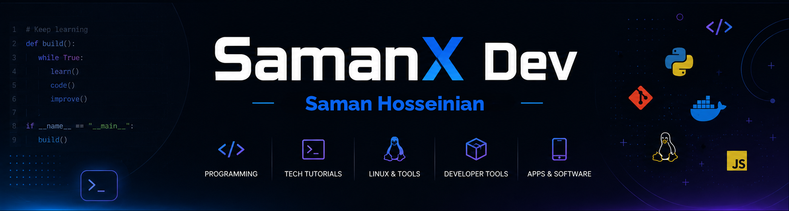

  

<h2 align="center">Hi there 👋</h2>

  I'm <b>Saman</b> 
  💻 Backend developer passionate about building scalable, reliable applications 
  🐍 Mainly working with <b>Python</b> and <b>Django</b>. 
  ⚡ Enthusiastic about clean code, open source, and continuous learning

---

<h3 align="center">🛠️ Skills & Tools</h3>

  

---

<h3 align="center">🚀 Featured Projects</h3>

  🔹 <a href="https://github.com/SamanXdev/Postino">Postino</a> – A postal site with tracking code and mail delivery record. 
  🔹 <a href="#">Project 2</a> – Short description.

---

<h3 align="center">📊 GitHub Stats</h3>

  
  

  
  

---

<h3 align="center">📫 How to reach me</h3>

  

  

  

---

✨ Always curious, always coding. ✨

